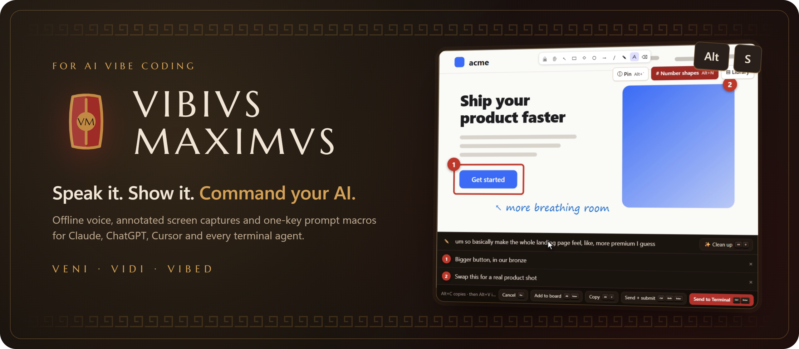
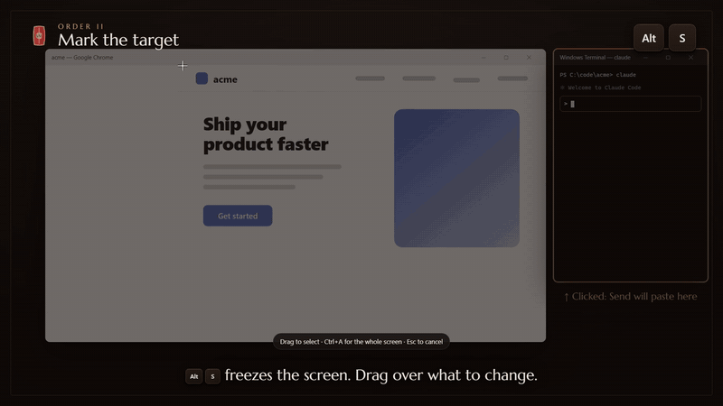
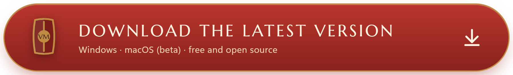
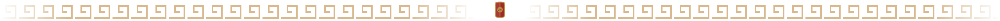
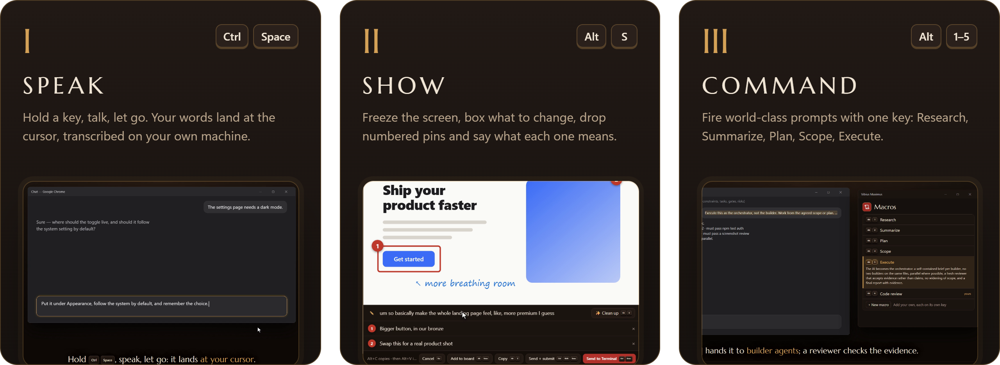
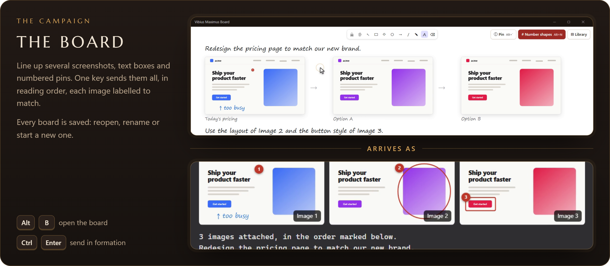
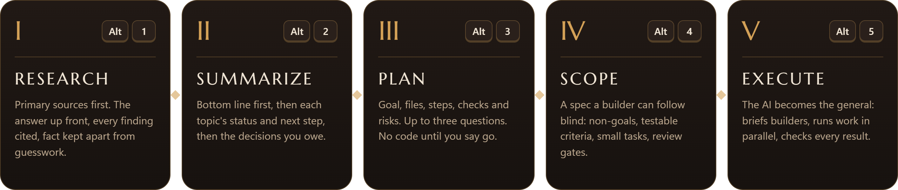

<p align="center">
  <picture>
    <source media="(prefers-color-scheme: light)" srcset="docs/readme/hero-light.png" />
    
  </picture>
</p>

<p align="center">
  <a href="https://github.com/bay714/VibiusMaximus/releases/latest"></a>
  <a href="https://github.com/bay714/VibiusMaximus/releases"></a>
  
  <a href="LICENSE"></a>
</p>

<p align="center">
  <a href="https://bay714.github.io/VibiusMaximus/#watch">
    
  </a>
  <br />
  <a href="https://bay714.github.io/VibiusMaximus/#watch"><b>▶ Watch the full video (3 min, with sound)</b></a>
</p>

<p align="center">
  <a href="https://github.com/bay714/VibiusMaximus/releases/latest">
    
  </a>
  <br />
  <a href="https://github.com/bay714/VibiusMaximus/releases/latest"><b>CLICK HERE TO DOWNLOAD THE LATEST VERSION</b></a>
  <br />
  <sub>Windows 10/11 · macOS (beta) · free and open source · <a href="https://bay714.github.io/VibiusMaximus/">website</a></sub>
</p>

<p align="center"></p>

## The three orders

Talk to your AI the way you'd brief a person: say it, point at it, and use the same proven prompts
every time.

<picture>
  <source media="(prefers-color-scheme: light)" srcset="docs/readme/pillars-light.png" />
  
</picture>

<br />

<picture>
  <source media="(prefers-color-scheme: light)" srcset="docs/readme/board-light.png" />
  
</picture>

## Standing orders

Five prompts on five keys, written from published prompting practice (Anthropic's and OpenAI's
guides, GitHub Spec Kit). Run them in order for a whole project, or fire any one on its own. Edit
any of them, or add your own, in **Settings → Macros**.

<picture>
  <source media="(prefers-color-scheme: light)" srcset="docs/readme/orders-light.png" />
  
</picture>

## Install

1. **[Download the latest release](https://github.com/bay714/VibiusMaximus/releases/latest).**
   - **Windows:** `VibiusMaximus_<version>_x64-setup.exe`.
   - **macOS (beta):** `_aarch64.dmg` for Apple silicon (M1 and later) or `_x64.dmg` for Intel. Drag
     the app to Applications. It isn't notarized by Apple yet, so the first time macOS blocks it:
     open **System Settings → Privacy & Security** and click **Open Anyway**. Then allow
     **Microphone**, **Accessibility** (to paste) and **Screen Recording** (to capture); after
     granting Screen Recording, quit and reopen the app. On a Mac, Alt is the Option key (⌥).
2. The first launch downloads a small offline speech model (Canary 180M Flash is recommended).
3. Hold `Ctrl+Space` (`⌥ Space` on a Mac) and talk. Press `Alt+S` to capture.

**Updates:** **Check for updates** in the app installs new versions in place. Your keys, macros,
captures and boards are kept.

## Every key

| Shortcut | What happens |
|---|---|
| `Ctrl+Space` (hold) | Dictate into any app, offline (`⌥ Space` on a Mac) |
| `Ctrl+Shift+Space` | Dictate with AI cleanup (`⌥ ⇧ Space` on a Mac; set a provider in Settings → Post-processing) |
| `Alt+S` | **Capture**: freeze the screen, drag a region, annotate it, drop numbered pins, speak a caption |
| `Alt+B` | **Board**: several images, text boxes and pins in one prompt |
| `Alt+1` … `Alt+5` | **Standing orders**: Research, Summarize, Plan, Scope, Execute |

<details>
<summary><b>Keys in the capture editor and the board</b></summary>

| Key | Action |
|---|---|
| `Ctrl+Enter` | Paste the image, then the caption and notes, into the app you came from (the Send button names it) |
| `Ctrl+Shift+Enter` | Same, then press Enter to submit |
| `Alt+C` | Copy the image and all the text together: one paste brings both |
| `Alt+V` | After `Alt+C`, in any app within 5 minutes: pastes each image, then the text |
| `Alt+Enter` | Add the capture to the board |
| ``Alt+` `` | **Pin**: the next click drops a numbered marker |
| `Alt+N` | Turn **# Number shapes** on or off: every shape you draw gets the next number and a note |
| `Alt+D` | ✨ AI cleanup of the caption and notes (undoable) |
| `Esc` | Cancel |

Every key can be changed in **Settings → Hotkeys**. Plain `Enter` never sends; it moves to the next
note. Numbers are ordinary objects: drag to move, `Delete` to remove, `Ctrl+Z` to undo. Terminals
(Windows Terminal, PowerShell, cmd; Terminal, iTerm2, Warp, Ghostty on a Mac) get a saved file path
plus the text instead of an image, which suits Claude Code and other terminal agents. Every capture
is kept in **Settings → Captures**; double-click one to edit it again. Every board is kept too:
**☰ Boards** reopens, renames or deletes them.

</details>

## Light by design

- **Offline speech.** Your voice is transcribed on your own machine.
- **Sleeps when idle.** The capture and board windows exist only while open; the speech model
  unloads after 2 minutes; nothing polls in the background.
- **Small.** An 18 MB installer, CPU-only on Windows, no GPU drivers needed.
- **Private by default.** AI cleanup only runs when you ask, with the provider you choose.

<details>
<summary><b>Build from source</b></summary>

Prerequisites: Rust (rustup), Bun, and on Windows Visual Studio 2022 Build Tools (C++ workload) and
CMake (the Vulkan SDK is **not** needed). On a Mac, Xcode.

```bash
bun install
mkdir -p src-tauri/resources/models
curl -o src-tauri/resources/models/silero_vad_v4.onnx https://blob.handy.computer/silero_vad_v4.onnx
bun run tauri dev        # run
bun run tauri build      # installers in src-tauri/target/release/bundle/
```

Tests: `bun src/board/compile.test.ts`, `bun src/board/dictation.test.ts`, `bun src/capture/keys.test.ts` and
`cd src-tauri && cargo test --lib vibe`.

CI: the **Windows** and **macOS** build workflows run on `v*` tags. The Windows build creates the
release; the macOS build adds its `.dmg` files and update-feed entries. Neither is code-signed by
Microsoft or Apple; updates are signed with our own key. The **website** workflow publishes
`site/` and the video to GitHub Pages.

README and website images: `bun scripts/brand/readme.ts` (from the Legion palette and stills of
the video). App and tray icons: `bun scripts/brand/generate.ts`.

Our code lives in `src-tauri/src/vibe/`, `src/capture/`, `src/board/` and
`src/components/settings/`; changes to Handy's own files are kept small. Plans and decisions:
[docs/PLAN.md](docs/PLAN.md).

</details>

## Credits

Vibius Maximus stands on the shoulders of giants:
[Handy](https://github.com/cjpais/Handy) by CJ Pais (offline speech-to-text, the app itself;
its original README is in [docs/HANDY.md](docs/HANDY.md)),
[Excalidraw](https://github.com/excalidraw/excalidraw) (the drawing canvas) and
[xcap](https://github.com/nashaofu/xcap) (screen capture). Headings are set in
[Marcellus](https://fonts.google.com/specimen/Marcellus) (OFL).

<p align="center">
  
  <br />
  <sub>MIT licensed · <b>Veni · Vidi · Vibed</b></sub>
</p>
