# VibiusMaximus mockups

Static screenshots of [`workflow.html`](workflow.html). Open that file in a browser to see the live version.
The build plan is in [`../PLAN.md`](../PLAN.md).

## Flow A: snap one element
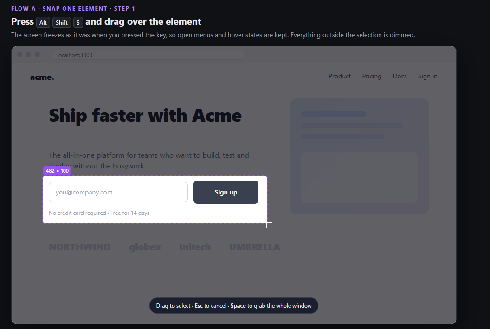
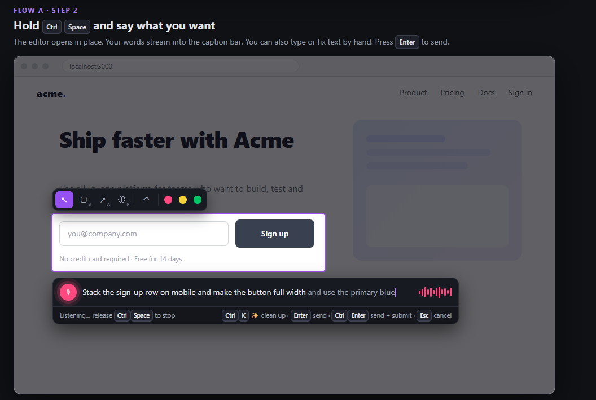

## Flow B: annotate many elements
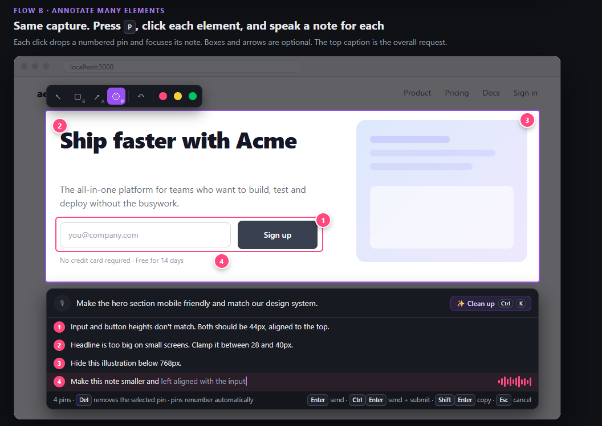

## Output: what lands in the chat
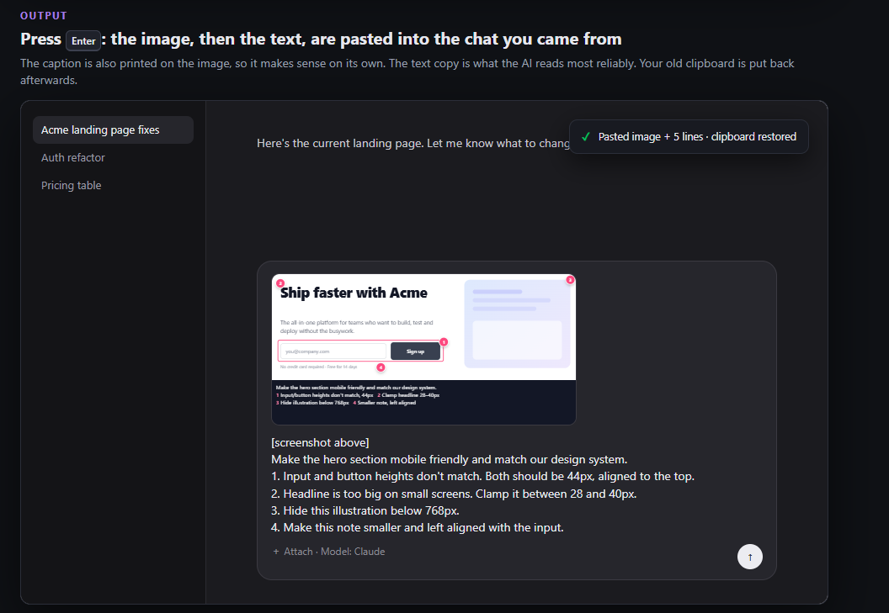

## Flow D: Board (build a prompt from many images)
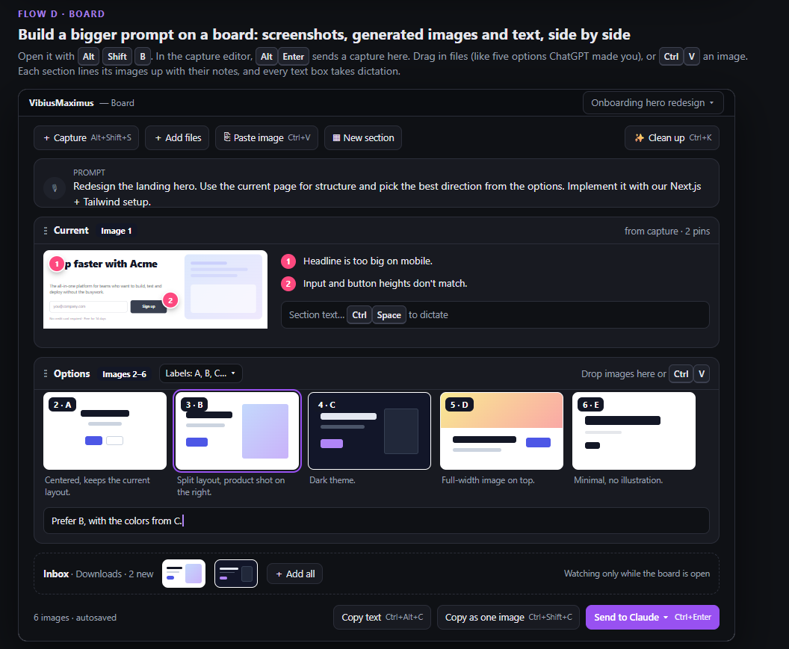
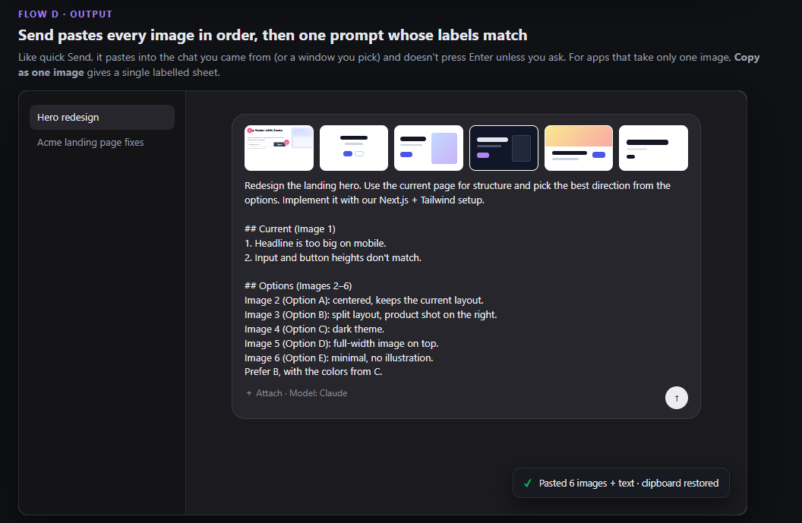

## Flow C: prompt macros
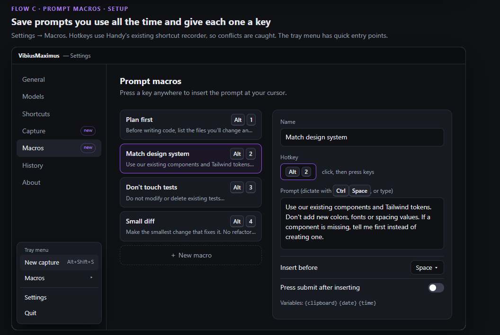
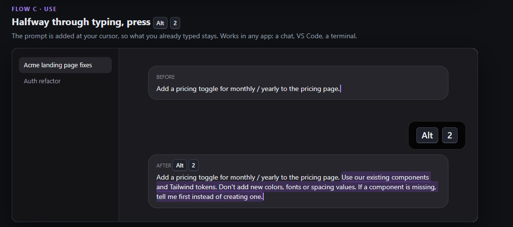

## AI cleanup
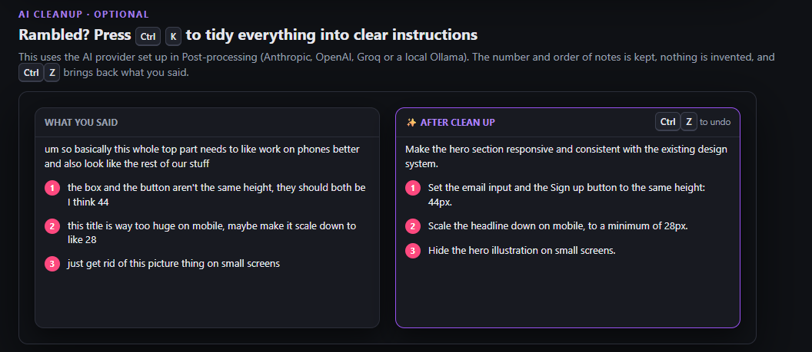

## Settings: Capture and paste profiles
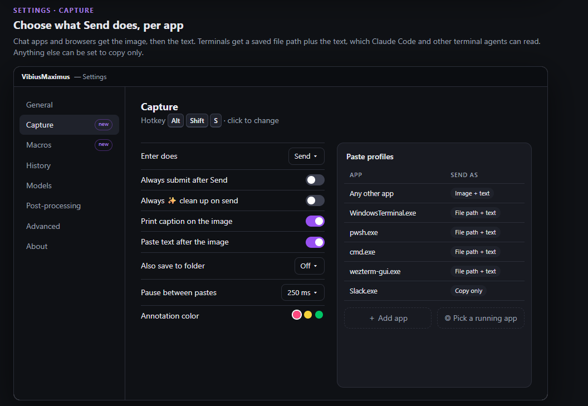

## History: Captures
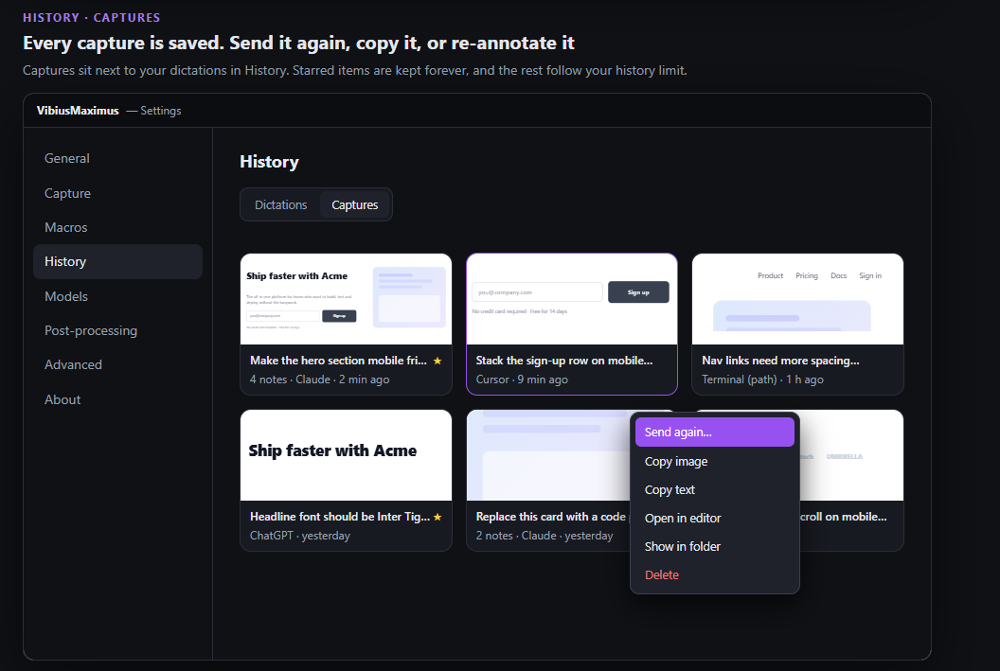
